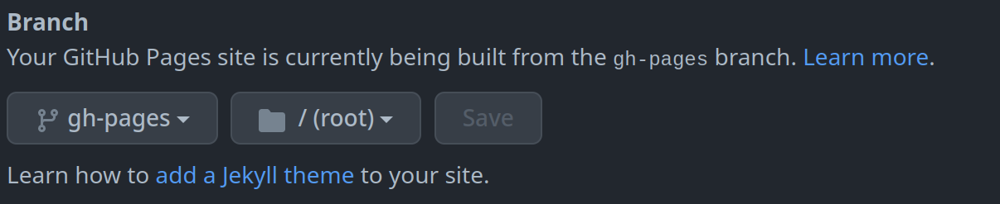

In this article, I would like to explain how this blog was made to incite more people to make theirs, 
to document the process I went through and I thought it would be an interesting idea for an article anyways.

## The Tech Stack

There's a lot of choices to be made to deploy a working blog with varying costs and complexity. 
In the beginning, I thought of making it as an SPA with React 
with some free CMS and hosting it on a VPS. 
But later on, I realised that I didn't need the flexibility that React offers me and I don't have the time to write the code.

So, I opted for a static site generator as what I intend to do is just post articles. 
I am not familiar with SSGs so I looked for the simplest one out there and I chose to use **Hugo**.

For deployment, the easiest and simplest one is GitHub Pages, so I went with that.

## Create the Hugo Project

It's pretty easy to get a working "Hello World" with Hugo. First off, I installed the CLI following [these instructions](https://gohugo.io/installation/).
Next up, I used the cli to initialize a new site as follows:
```shell
hugo new site ahmedmoalla.github.io
```
> Notice the repo's name. It's in the format <GITHUB_USERNAME>.github.io. This naming convention is **required** to use GitHub Pages.

## Choose a Hugo Theme

The theme I chose to use is [Hermit](https://hugo-theme-hermit.netlify.app/). 
To install it, I cloned it as a Git submodule under the `themes` folder as follows:
```shell
git init
git submodule add https://github.com/Track3/hermit themes/hermit
```
Next, I added the configuration needed to tell Hugo about the theme in the `config.toml` file by adding `theme = "hermit"`.

That's it ! I had a working Hugo site with a nice, simple theme. To see the result locally, run `hugo server` on the root of the project.

## Deploy the Site

Now I had a working site that I needed to deploy. The process is pretty straightforward with GitHub Pages. 
You only need to build your site with the CLI and push the result to a repository in the format `<GITHUB_USERNAME>.github.io`.

This is easy and it works, but it requires you to build the files locally everytime you do a modification. 
Luckily, in the [Hugo documentation](https://gohugo.io/hosting-and-deployment/hosting-on-github/), they clearly explain how to automate this process using GitHub actions.

Under the path `.github/workflows`, create a YAML file as follows:
```yaml
name: Github Pages

on:
  push:
    branches:
      - main  # Set a branch that will trigger a deployment
  pull_request:

jobs:
  deploy:
    runs-on: ubuntu-22.04
    steps:
      - uses: actions/checkout@v3
        with:
          submodules: true  # Fetch Hugo themes (true OR recursive)
          fetch-depth: 0    # Fetch all history for .GitInfo and .Lastmod

      - name: Setup Hugo
        uses: peaceiris/actions-hugo@v2
        with:
          hugo-version: 'latest'
          extended: true

      - name: Build
        run: hugo --minify

      - name: Deploy
        uses: peaceiris/actions-gh-pages@v3
        if: github.ref == 'refs/heads/main'
        with:
          github_token: ${{ secrets.GITHUB_TOKEN }}
          publish_dir: ./public
```
The workflow defined triggers when code is pushed in the `main` branch. 
The workflow clones the `main` branch, builds it with the CLI and then pushes the result to a `gh-pages` branch.

With this workflow, the build becomes completely automatic. 
But, by default, GitHub Pages serves the content from the `main` branch, so I needed to point it to the `gh-pages` branch.
Go to your repository's Settings > Code and automation > Pages, and change the branch to `gh-pages`.



The last thing to do is to add the `baseURL=https://<GITHUB_USERNAME>.github.io` property in the `config.toml` file as it is necessary for absolute links to work.

That's it ! Now I had a working site on the domain `<GITHUB_USERNAME>.github.io`

## Use a Custom Domain

If you want your site to be served from a custom domain, the [documentation](https://docs.github.com/en/pages/configuring-a-custom-domain-for-your-github-pages-site) 
for GitHub Pages explains how to do it.

You need to create a CNAME record under your domain that points to `<GITHUB_USERNAME>.github.io`. In my case, I use Google
domains and the process is straightforward. Under the domain management screen, go to DNS and add your record.


On GitHub's side, we need to tell it that we intend to serve our site from a custom domain.


The last step is to update the `baseURL` property in the `config.toml` file to point to your custom domain.

With this, I had a fully working blog with automated builds and served on a custom domain over HTTPS.